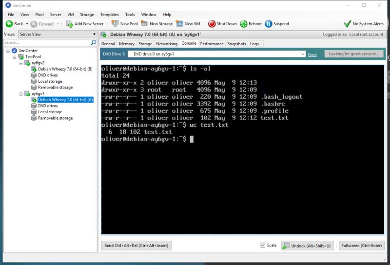
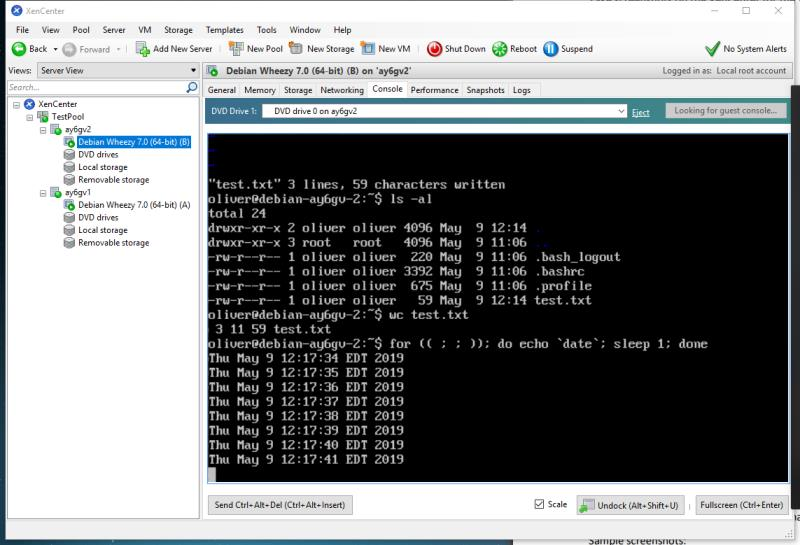
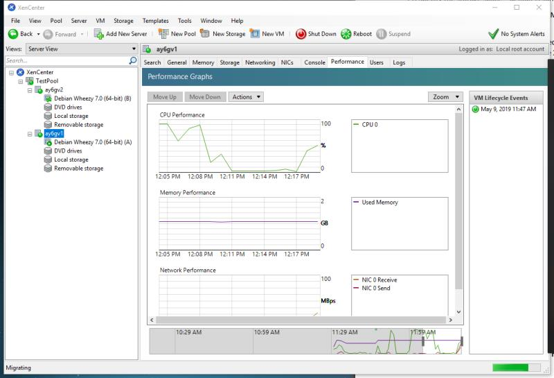
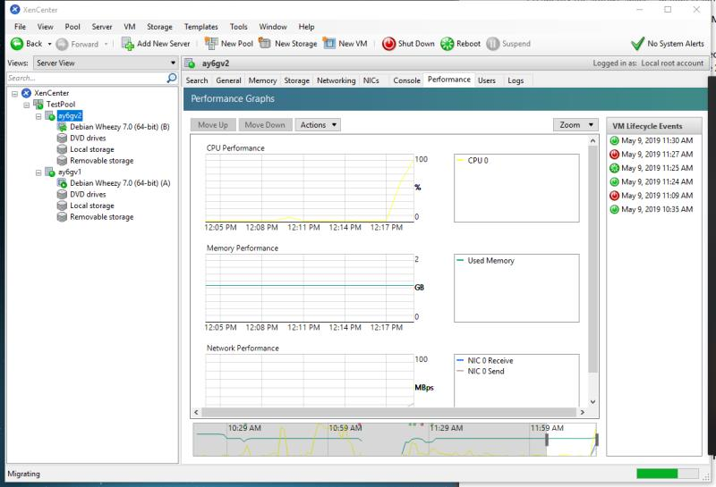
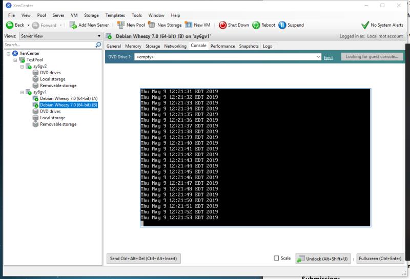
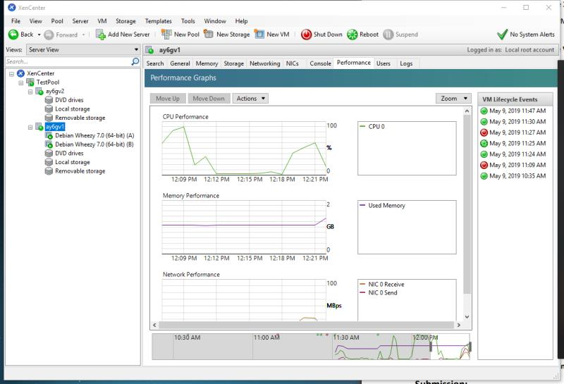
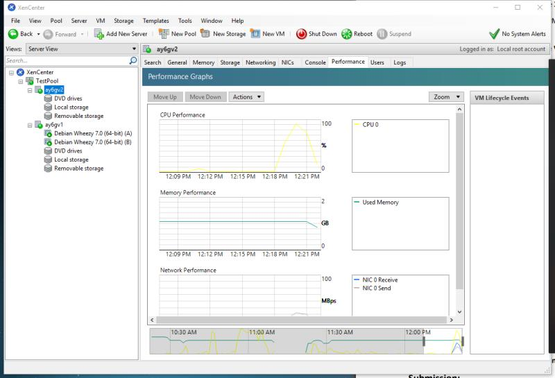
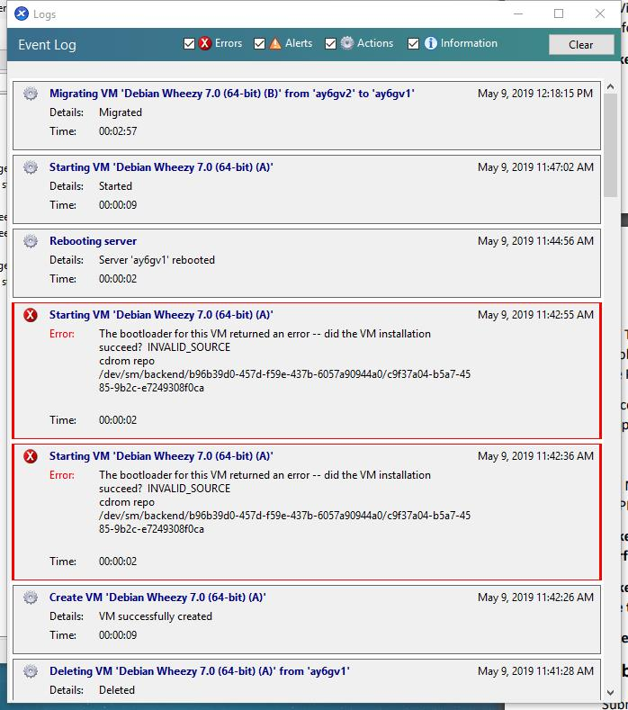

# VM Migration

## Tests of VMs

Create a file named `test.txt` with some random texts through `vi` in each of the VM.

VM-1 can run command successfully.

VM-2 can run command successfully.

## During Migration

Run command `for (( ; ; )); do echo `date`; sleep 1; done` in VM-2 and migrate it from PM-2 to PM-1.

The performance of PM-1 during migration

The performance of PM-2 during migration

## After Migration

The command keeps running in the VM-2 but now on top of PM-1.

The performance of PM-1 during migration

The performance of PM-2 during migration

## The migration log

The event log of the migration (it contains some error events because I forgot to load the `debian.iso` into the optical drive)

